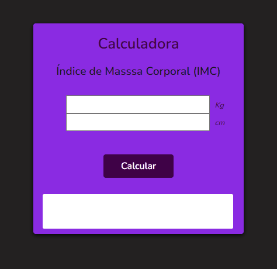

# Calculadora IMC 

---
* Programa desenvolvido para calcular o Índice de Massa Corporal a partir dos valores de peso e altura.

* O resultado dará o valor do imc e a classificação de acordo com a tabela da OMS (Organização Mundial da Saúde).

